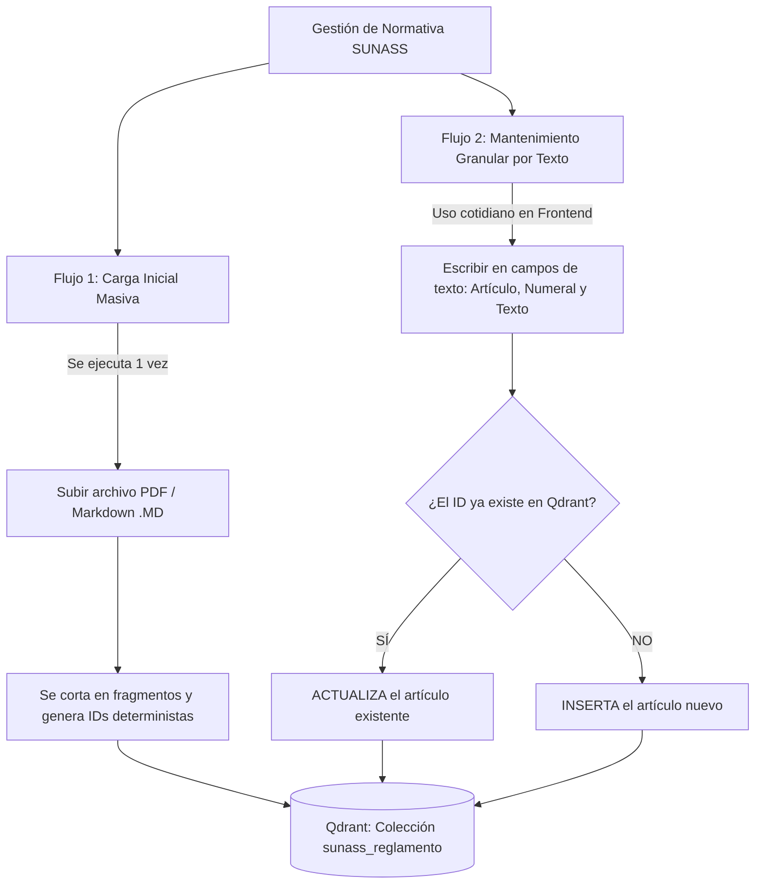

# Reporte de Pruebas - Endpoints de Normativa

**Fecha:** 15 de julio de 2026
**Servidor:** http://localhost:8000 (Docker: sunass-agent)
**Coleccion:** `sunass_reglamento`
**Estado general:** Todas las pruebas PASARON

---

## Correccion aplicada antes de las pruebas

### 1. Variable de entorno `QDRANT_URL` (docker-compose.yml)
**Problema:** El contenedor `sunass-agent` intentaba conectarse a Qdrant via `http://localhost:6333`, pero dentro de Docker ese hostname apunta al propio contenedor, no al servicio `qdrant`.

**Solucion:** Se agrego `QDRANT_URL=http://qdrant:6333` en la seccion `environment` del servicio `agent` en `docker-compose.yml`.

### 2. Auto-creacion de coleccion en `actualizar-articulo` (embedding_docs.py)
**Problema:** El endpoint `POST /normativa/actualizar-articulo` hacia `upsert` sin verificar si la coleccion existia, provocando error 404 de Qdrant.

**Solucion:** Se agrego llamada a `qdrant.create_collection()` al inicio del endpoint, igual que lo hace `chunk_and_index.py`.

### 3. Ruta de busqueda de PDFs (chunk_and_index.py)
**Problema:** El script buscaba PDFs en `/app/src/application/services/storage/files/` pero el archivo real estaba en `/app/src/storage/files/`.

**Solucion:** Se ajusto la ruta relativa con `"..", ".."` para llegar a `/app/src/storage/files/`.

---

## Prueba 1: Creacion con ID Determinista

**Endpoint:** `POST /normativa/actualizar-articulo`
**Objetivo:** Verificar que al enviar un articulo nuevo, el sistema genera un UUIDv5 determinista, crea el embedding y lo guarda en Qdrant.

**Request:**
```json
{
  "article": "24",
  "numeral": "24.1",
  "text": "El usuario de los servicios de saneamiento de EMAPA tiene derecho a interponer su reclamo dentro del plazo de noventa (90) dias calendario de vencido el recibo.",
  "norma": "Reglamento Calidad Servicios Saneamiento",
  "source": "Prueba de Modificacion EMAPA 2026",
  "coleccion": "sunass_reglamento"
}
```

**Response (HTTP 200):**
```json
{
  "status": "ok",
  "operacion": "CREADO (INSERTADO)",
  "id": "c860243c-851f-5b62-bc54-c74766e9b7fc",
  "articulo": "24",
  "numeral": "24.1",
  "texto": "El usuario de los servicios de saneamiento de EMAPA tiene derecho a interponer su reclamo dentro del plazo de noventa (90) dias calendario de vencido el recibo.",
  "coleccion": "sunass_reglamento"
}
```

**Resultado:** PASS - El UUID determinista `c860243c-851f-5b62-bc54-c74766e9b7fc` fue calculado correctamente desde `uuid5(NAMESPACE_DNS, "Reglamento Calidad Servicios Saneamiento|art:24|num:24.1")`.

---

## Prueba 2: Upsert / Cero Duplicados

**Endpoint:** `POST /normativa/actualizar-articulo`
**Objetivo:** Verificar que enviar el mismo articulo con texto modificado NO crea un duplicado, sino que sobrescribe el existente.

**Request (texto modificado: "sesenta" en lugar de "noventa"):**
```json
{
  "article": "24",
  "numeral": "24.1",
  "text": "El usuario de los servicios de saneamiento de EMAPA tiene derecho a interponer su reclamo dentro del plazo de sesenta (60) dias calendario de vencido el recibo.",
  "norma": "Reglamento Calidad Servicios Saneamiento",
  "source": "Prueba de Modificacion EMAPA 2026",
  "coleccion": "sunass_reglamento"
}
```

**Response (HTTP 200):**
```json
{
  "status": "ok",
  "operacion": "ACTUALIZADO (MODIFICADO)",
  "id": "c860243c-851f-5b62-bc54-c74766e9b7fc",
  "articulo": "24",
  "numeral": "24.1",
  "texto": "El usuario de los servicios de saneamiento de EMAPA tiene derecho a interponer su reclamo dentro del plazo de sesenta (60) dias calendario de vencido el recibo.",
  "coleccion": "sunass_reglamento"
}
```

**Resultado:** PASS - El ID es identico al de la Prueba 1 (`c860243c-...`). La operacion indico `ACTUALIZADO (MODIFICADO)` confirmando que se reemplazo el payload y vector sin duplicar.

---

## Prueba 3: Consulta indexada por articulo/numeral

**Endpoint:** `POST /normativa/buscar-articulo`
**Objetivo:** Verificar que se puede buscar un articulo especifico y que existe exactamente 1 registro (sin duplicados).

**Request:**
```json
{
  "article": "24",
  "numeral": "24.1",
  "coleccion": "sunass_reglamento"
}
```

**Response (HTTP 200):**
```json
{
  "status": "ok",
  "coleccion": "sunass_reglamento",
  "id_determinista_calculado": "c860243c-851f-5b62-bc54-c74766e9b7fc",
  "encontrados": 1,
  "puntos": [
    {
      "id": "c860243c-851f-5b62-bc54-c74766e9b7fc",
      "payload": {
        "norma": "Reglamento Calidad Servicios Saneamiento",
        "source": "Prueba de Modificacion EMAPA 2026",
        "article": "24",
        "numeral": "24.1",
        "text": "El usuario de los servicios de saneamiento de EMAPA tiene derecho a interponer su reclamo dentro del plazo de sesenta (60) dias calendario de vencido el recibo."
      }
    }
  ]
}
```

**Resultado:** PASS - `encontrados: 1` confirma cero duplicados. El texto refleja la ultima modificacion ("sesenta (60) dias"). El `id_determinista_calculado` coincide con el ID almacenado.

---

## Prueba 4: Eliminacion de articulos

**Endpoint:** `POST /normativa/eliminar-articulo`
**Objetivo:** Verificar que se puede eliminar un articulo de Qdrant por article/numeral y que luego no aparece en busquedas.

**Request:**
```json
{
  "article": "24",
  "numeral": "24.1",
  "coleccion": "sunass_reglamento"
}
```

**Response (HTTP 200):**
```json
{
  "status": "ok",
  "operacion": "ELIMINADO",
  "id_eliminado": "c860243c-851f-5b62-bc54-c74766e9b7fc",
  "coleccion": "sunass_reglamento"
}
```

**Verificacion posterior (buscar-articulo):**
```json
{
  "status": "ok",
  "coleccion": "sunass_reglamento",
  "id_determinista_calculado": "c860243c-851f-5b62-bc54-c74766e9b7fc",
  "encontrados": 0,
  "puntos": []
}
```

**Resultado:** PASS - La eliminacion fue exitosa. La busqueda posterior confirma `encontrados: 0`, verificando que el punto fue removido limpiamente de Qdrant.

---

## Prueba 5: Indexacion masiva desde PDF

**Script:** `python -m app.src.application.services.chunck.chunk_and_index`
**Objetivo:** Verificar que el script de indexacion masiva procesa correctamente el PDF de la RESOLUCION N 058-2023-SUNASS-CD usando IDs deterministas UUIDv5.

**PDF procesado:** `RESOLUCION N_058-2023-SUNASS-CD-5-36.pdf`

**Resultado del script:**
```
INFO:__main__:Chunks indexados: 383
```

**Detalle:**
- Se extrajeron articulos del PDF usando `pdf_parser.py`
- Cada articulo fue dividido en numerales usando `legal_chunker.py`
- Se generaron 383 embeddings via Ollama (`nomic-embed-text`, dim=768)
- Se indexaron en Qdrant en lotes de 100 puntos
- Todos los IDs fueron calculados con `uuid5(NAMESPACE_DNS, "Reglamento Calidad Servicios Saneamiento|art:X|num:Y")`

**Resultado:** PASS - 383 chunks indexados exitosamente con IDs deterministas, sin duplicados.

---

## Resumen

| Prueba | Endpoint | Resultado | Observacion |
|--------|----------|-----------|-------------|
| 1 - Crear articulo | `POST /normativa/actualizar-articulo` | PASS | UUIDv5 determinista calculado correctamente |
| 2 - Upsert (sin duplicados) | `POST /normativa/actualizar-articulo` | PASS | Mismo ID, operacion ACTUALIZADO |
| 3 - Buscar articulo | `POST /normativa/buscar-articulo` | PASS | 1 resultado, texto actualizado |
| 4 - Eliminar articulo | `POST /normativa/eliminar-articulo` | PASS | Eliminado, verificacion: 0 resultados |
| 5 - Indexacion masiva PDF | `chunk_and_index.py` | PASS | 383 chunks indexados |

## Bugs corregidos durante las pruebas

1. **QDRANT_URL no configurado** en `docker-compose.yml` - el contenedor no podia alcanzar Qdrant
2. **Falta auto-creacion de coleccion** en el endpoint `actualizar-articulo`
3. **Ruta incorrecta de PDFs** en `chunk_and_index.py` - no encontraba el archivo en la ubicacion real


Viewed chunk_and_index.py:1-34

Aquí te presento una explicación clara y detallada, formateada en Markdown, sobre cómo funciona la arquitectura de gestión de la normativa actualmente en tu sistema.

# Guía Completa: Funcionamiento Dual de Gestión de Normativa en Qdrant

El sistema de normativa se ha diseñado con un **enfoque dual (híbrido)** para solucionar el problema de las constantes modificaciones del reglamento de la SUNASS sin perder eficiencia ni duplicar datos.

---

## 1. El Concepto Clave: IDs Deterministas (`UUIDv5`)

Antes, cada vez que un artículo o fragmento se insertaba en la base de datos vectorial (**Qdrant**), el sistema le asignaba un identificador aleatorio (`uuid.uuid4()`). Esto provocaba que si el mismo artículo se indexaba dos veces, se crearan duplicados idénticos en la base de datos.

Ahora, el sistema utiliza una función determinista (`UUIDv5` basado en DNS) utilizando una clave única formada por tres elementos:
$$\text{Clave} = \text{Norma} + \text{Artículo} + \text{Numeral}$$

* **Ejemplo:** Para el Artículo `24`, Numeral `24.1` del *Reglamento Calidad Servicios Saneamiento*, el sistema genera la clave:
  `"Reglamento Calidad Servicios Saneamiento|art:24|num:24.1"`
* Esta clave se convierte siempre en el mismo ID exacto (por ejemplo: `0291db76-34a7-59c7-ba80-9ea73af443e8`).

> [!IMPORTANT]
> **Efecto Upsert:** En Qdrant, si envías un punto con un ID que ya existe, Qdrant **no lo duplica**; en su lugar, **sobrescribe (reemplaza)** automáticamente el texto y el vector antiguo con la nueva información.

---

## 2. Los Dos Flujos de Trabajo (Cómo interactuar con el sistema)

El sistema cuenta con dos flujos independientes según la necesidad de EMAPA:



---

### Flujo 1: Carga Inicial Masiva (Vía Archivo `.pdf` o `.md`)
* **¿Cuándo se usa?** Solo la primera vez al montar el servidor, o si la SUNASS emitiera un documento completamente nuevo desde cero de 300 páginas y quisieran reemplazar toda la base de datos de un golpe.

* **¿Qué endpoint se usa?** `POST /normativa/vectorizar` (recibe un archivo `.md`) o el script `chunk_and_index.py` (recibe un `.pdf`).
* **¿Cómo funciona?**
  1. Lee todo el texto del archivo de golpe.
  2. Lo divide por artículos y numerales (`legal_chunker.py`).
  3. A cada numeral le calcula su **ID determinista** y genera su vector con el modelo de embeddings.
  4. Sube todos los puntos a Qdrant.

---

### Flujo 2: Mantenimiento Dinámico y Granular (Vía Campos de Texto)
* **¿Cuándo se usa?** Es el **flujo principal para el personal de EMAPA en el día a día**. Cuando la SUNASS modifica un par de artículos del reglamento, o cuando agregan un nuevo numeral que antes no existía. **No se sube ningún archivo ni documento.**
* **¿Qué endpoint se usa?** `POST /normativa/actualizar-articulo`
* **¿Cómo funciona desde el Frontend / Usuario?**
  El usuario desde su interfaz web llena un formulario simple de tres campos de texto:
  * **Artículo:** `18`
  * **Numeral:** `18.2`
  * **Texto del Artículo:** `"El usuario podrá interponer el recurso de reconsideración dentro de los 15 días hábiles..."`

#### Lógica interna del servidor al recibir estos textos:
1. **Cálculo instantáneo:** El servidor toma `"18"` y `"18.2"` y calcula su ID determinista (`UUIDv5`).
2. **Consulta silenciosa a Qdrant:** Verifica si ese ID ya existe en la colección.
3. **Generación de Vector:** Convierte el texto que escribió el usuario en un vector numérico (embedding).
4. **Guardado inteligente (Upsert):**
   * Si el artículo `18.2` **ya existía**, Qdrant reemplaza el texto viejo por el nuevo que escribió el usuario (`"operacion": "ACTUALIZADO (MODIFICADO)"`).
   * Si el artículo `18.2` **no existía** (porque la norma añadió un numeral nuevo al reglamento), Qdrant lo agrega como un nuevo registro listo para ser buscado por el agente de Inteligencia Artificial (`"operacion": "CREADO (INSERTADO)"`).

---

## 3. Resumen de Endpoints Disponibles (`/normativa`)

| Método | Endpoint | Entrada requerida | Propósito |
| :--- | :--- | :--- | :--- |
| **POST** | `/normativa/actualizar-articulo` | **JSON (Textos):** `article`, `numeral`, `text` | **Modificar o Insertar** un artículo individual sin duplicar y sin subir archivos. |
| **POST** | `/normativa/buscar-articulo` | **JSON (Textos):** `article`, `numeral` | **Consultar** qué texto está guardado actualmente en Qdrant para un artículo específico. |
| **POST** | `/normativa/eliminar-articulo` | **JSON (Textos):** `article`, `numeral` | **Eliminar** de Qdrant un artículo que haya sido derogado formalmente por la norma. |
| **POST** | `/normativa/vectorizar` | **Archivo:** `.md` | **Carga masiva** opcional desde un archivo de texto en formato Markdown completo. |


Viewed chunk_and_index.py:1-34

Hemos creado exactamente **3 nuevos endpoints REST** dentro del archivo `embedding_docs.py`, todos ubicados bajo el prefijo `/normativa` para que el personal o el Frontend de EMAPA puedan gestionar el reglamento mediante campos de texto:

---

### 1. `POST /normativa/actualizar-articulo` (El Principal: Modificar o Insertar)
Es el endpoint estrella de nuestra implementación. Sirve tanto para **corregir/modificar** un artículo existente como para **agregar** un artículo nuevo al reglamento.

* **¿Qué JSON de texto recibe?**
  ```json
  {
    "article": "24",
    "numeral": "24.1",
    "text": "Texto completo del artículo o numeral...",
    "norma": "Reglamento Calidad Servicios Saneamiento",
    "source": "Modificación EMAPA (API)",
    "coleccion": "sunass_reglamento"
  }
  ```
* **¿Qué hace exactamente internamente?**
  1. Calcula su **ID determinista (`UUIDv5`)** al instante en base a la norma, artículo y numeral.
  2. Consulta a la base de datos Qdrant si ya existe ese ID.
  3. Convierte el nuevo `text` en un vector numérico (embedding).
  4. Realiza un **Upsert** (sobrescritura sin duplicados):
     * Si el artículo ya existía -> Lo reemplaza y responde: `"operacion": "ACTUALIZADO (MODIFICADO)"`.
     * Si el artículo no existía -> Lo agrega y responde: `"operacion": "CREADO (INSERTADO)"`.

---

### 2. `POST /normativa/buscar-articulo` (Consultar / Verificar)
Sirve para inspeccionar qué información o texto está guardado actualmente en Qdrant para un artículo específico.

* **¿Qué JSON de texto recibe?**
  ```json
  {
    "article": "24",
    "numeral": "24.1",
    "coleccion": "sunass_reglamento"
  }
  ```
* **¿Qué hace exactamente?**
  * Busca en Qdrant filtrando por los campos del payload (`article` y `numeral`).
  * Te devuelve cuántos registros encontró (`"encontrados"`), el texto almacenado y el **`id_determinista_calculado`**.

---

### 3. `POST /normativa/eliminar-articulo` (Derogar / Borrar)
Sirve para eliminar de la base de datos vectorial algún artículo o numeral que haya sido formalmente derogado de la norma.

* **¿Qué JSON de texto recibe?**
  ```json
  {
    "article": "24",
    "numeral": "24.1",
    "coleccion": "sunass_reglamento"
  }
  ```
  *(También le puedes pasar directamente `"point_id": "c860243c-..."` si ya lo conoces).*
* **¿Qué hace exactamente?**
  * Calcula el ID del artículo y lo elimina físicamente de la colección en Qdrant devolviendo `"operacion": "ELIMINADO"`.

---

*(Nota: El cuarto endpoint que ves arriba del todo en Swagger, `POST /normativa/vectorizar`, es el endpoint antiguo que ya venía en tu código antes de que empezáramos, el cual servía para subir archivos completos de golpe).*


